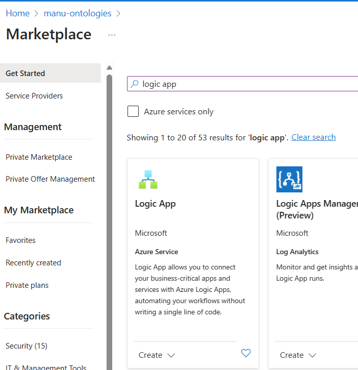
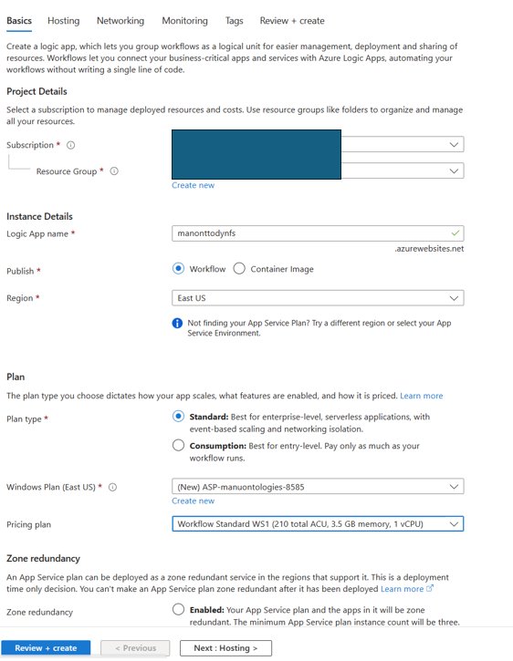
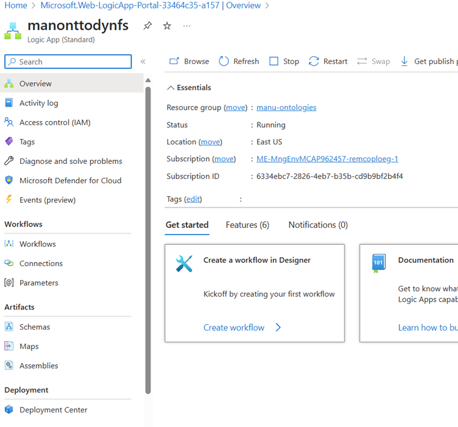
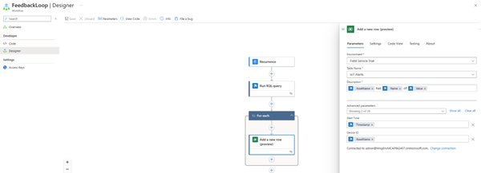

# Configure Dynamics365 Field Services Integration

The aim of this integration is to showcase the following scenarios:

- Create Assets from the manufacturing ontologies into Dynamics Field Services Assets.
- Create IoT Alerts in Dynamics Field Services when a certain threshold has been reached.

This configuration cannot be used for production situations, but it just to showcase how both solutions can be connected.

For the integration we have used Azure Logics Apps. With Logic Apps you can connect bussiness-critcal apps and services without writing a single line of code. We will fetch information from the Azure Data Explorer database to store into Dynamics365 Field Services.

## Setup the standard services

First of all you need to activate a trial for Dynamics Field Services. You can do this [here](https://dynamics.microsoft.com/en-us/field-service/field-service-management-software/free-trial) and you will get a 30 days trial. Important to remember is to use the same Azure Entra ID (former Azure Active Directory) as the manufacturing ontologies, else you need to configure cross tenant authentication. That is not part of this manual. If you have activated your trial, you are good to go!

### Create Azure Logic App to create assets in Dynamics365 Field Services

Let's start with getting the assets from the manufacturing ontologies into Dynamics365 FS. For that we will use an Azure Logic App.

1; Go to the Azure Portal and create a new Logic App as shown below:



2; Give the Azure Logic App a name, place it in the right resource group.



3; Click in the left navigation bar on 'Workflows':



4; Give your flow a name - for this scenario we will use the stateful state type, because assets are not flows of data.


5; Create a new trigger. We will start with creating a 'Recurrence' tigger. This will check the database every day if new assets are created. Off course you can change this more often.


6; In the next action, search for 'Azure Data Explorer' and select the 'Run KQL query' command. Within this query we will search the Azure Digital Twins what kind of assets the twin has. Uw the following query to get your assets and paste it in the query field:

```TEXT
let ADTInstance =  "PLACE YOUR ADT URL";let ADTQuery = "SELECT T.OPCUAApplicationURI as AssetName, T.$metadata.OPCUAApplicationURI.lastUpdateTime as UpdateTime FROM DIGITALTWINS T WHERE IS_OF_MODEL(T , 'dtmi:digitaltwins:opcua:nodeset;1') AND T.$metadata.OPCUAApplicationURI.lastUpdateTime > 'PLACE DATE'";evaluate azure_digital_twins_query_request(ADTInstance, ADTQuery)
```


7; To get your data into Dynamics365 Field Services you need to connect to the Microsoft Dataverse. Connect to your Dynamics365 FS instance and use the following configuration:

- Use the 'Customer Assets' Table Name
- But the 'AssetName' into the Name field


8; Save your workflow and run it! You will see in several seconds new assets will be created in Dynamics365 FS.


### Create Azure Logic App to create IoT Alerts in Dynamics365 Field Services

This workflow will create IoT Alerts into Dynamics365 FS when a certain threshold of FaultyTime will be reached. I have used the same logic as the previous flow.

1; Because there are some limitations in the connector, we first need to create an Azure Data Explorer function to get this working. Go to your Azure Data Explorer query webpage and run the following code to create a FaultyFieldAssets function.


```TEXT
.create-or-alter function  FaultyFieldAssets() {  
let Lw_start = ago(3d);
opcua_telemetry
| where Name == 'FaultyTime'
and Value > 0
and Timestamp between (Lw_start .. now())
| join kind=inner (
    opcua_metadata
    | extend AssetList =split (Name, ';')
    | extend AssetName=AssetList[0]
    ) on DataSetWriterID
| project AssetName, Name, Value, Timestamp}
```

2; Create a new workflow in the Azure Logic App. Create a 'Recurrance' trigger to start - every 3 minutes. Create as action 'Azure Data Explorer' and select the Run KQL Query.


3; Put your cluster URL, select your database and use the Function name created in step 1 as Query.


4; Select Microsoft Dataverse as next action and put the below configuration in the fields.



5; Run the workflow and you should see new IoT Alerts in your Dynamics365 FS dashboard!


