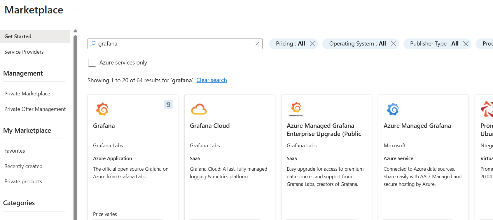
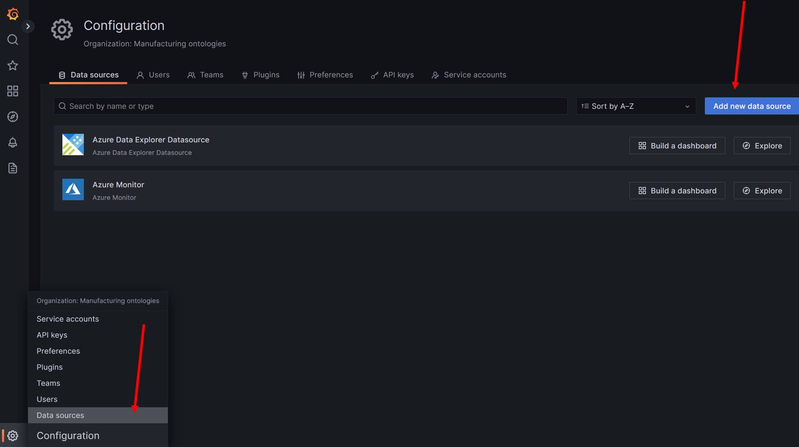
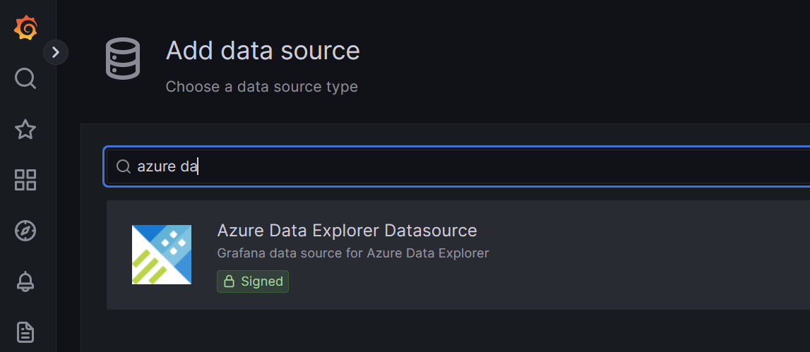
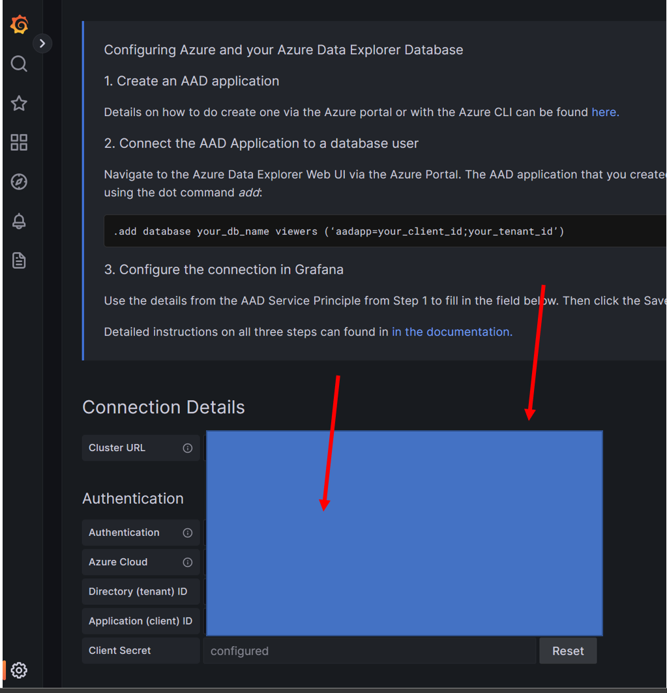
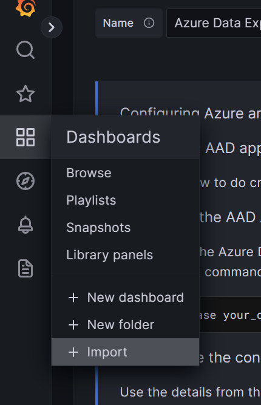
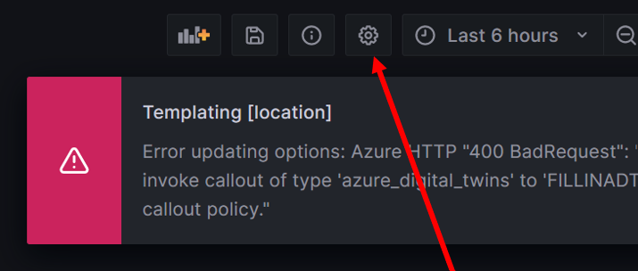

# Configuring the Azure Managed Grafana Dashboard

## Grafana Introduction
Grafana is used within manufacturing to create dasbhoards that displays real-time data. Azure offers a service named Azure Managed Grafana. With this, you can create cloud dashboards. In this configuration manual, you will enable Grafana on Azure and you will create a dashboard with data that is queried from Azure Data Explorer and Azure Digital Twins service, using the simulated production line data from this reference solution. Below is a screenshot from the dashboard:

## Enable Azure Managed Grafana Service

Go to the Microsoft Azure portal and search for the service 'Grafana' and select the 'Azure Managed Grafana' service.

Give your instance a name and leave the standard options on - and create the service. 

After the service is created, navigate to the URL where you can have access to your Grafana instance. You can find the URL in the homepage of the service. 

## Add new Datasource in Grafana

After your first login, you will need to add a new data source to Azure Data Explorer. Navigate to 'Configuration' and add a new datasource.

Search for Azure Data Explorer and select the service.

Configure your connection and use the app registration (follow the manual that is provided on the top of this page).

Save and test your connection on the bottom of the page. 

## Import a Sample Dashboard

Now we can import the provided sample dashboard. You can download it here: [Sample Grafana Manufacturing Dashboard](samplegrafanadashboard.json)

Then go to 'Dashboard' and select 'Import'.

Select the source that you have downloaded and click on 'Save'. You will get an error on the page, because two variables are not set yet. Go the the settings page of the dashboard.

Select on the left on 'Variables' and update the two URL with the URL of your Azure Digital Twins Service. 

Then, navigate back to the dashboard and hit the refresh button. You should now see data (don't forget to hit the save button on the dashboard).

The location variable on the top of the page is automatically filled with data from Azure Digital Twins (the area nodes from ISA95). Here you can select the different locations and see the different datapoints of every factory. 

If data is not showing up in your dashboard, please navigate to the individual panels and see if the right data source is selected:

