# Configure Microsoft Sustainability Manager

## Introduction
Microsoft Sustainability Manager (MSM) is an extensible solution that unifies data intelligence and provides comprehensive, integrated, and automated sustainability management for organizations at any stage of their sustainability journey. It automates manual processes, enabling organizations to more efficiently record, report, and reduce their emissions.

In the simulated production also the energy usage of every machine is collected. This data can be loaded into MSM for reporting on scope 2 emissions. Below the global steps how this works. This is more complicated, but it gives a high level understanding what is happening.

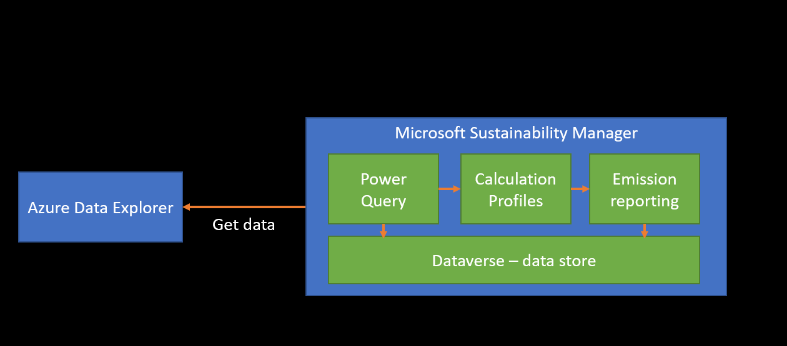

## Setup Trial account
When you want to use the Microsoft Sustainability Manager (MSM),can you start with a 30 day trial. 

1. For that you need to go to [this](https://www.microsoft.com/en-us/sustainability/cloud) trialpage. Enter there your e-mailadres, agree with the term and click on 'Start your free trial'
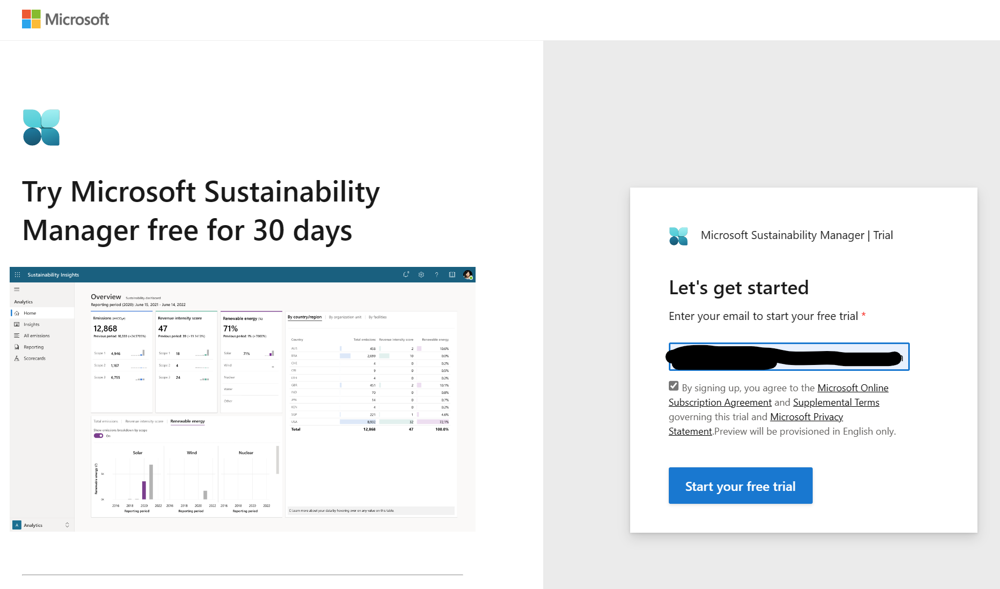

2. After that select your country and add your phonenumber. 


3. Your MSM environment is ready to go. 


4. We need to create a new facility in MSM to connect the production lines of this example to the rigth facility. Navigate to the left bottom menu and select 'Settings'.

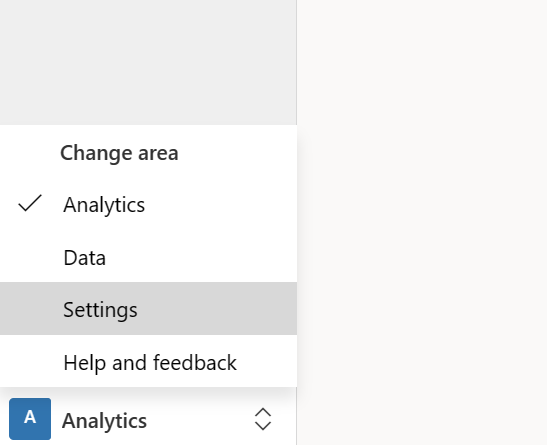

5. Click on 'Add new facility' and create your own facility name that you want to create, for example "Seattle'. Important to add the address of the facility.

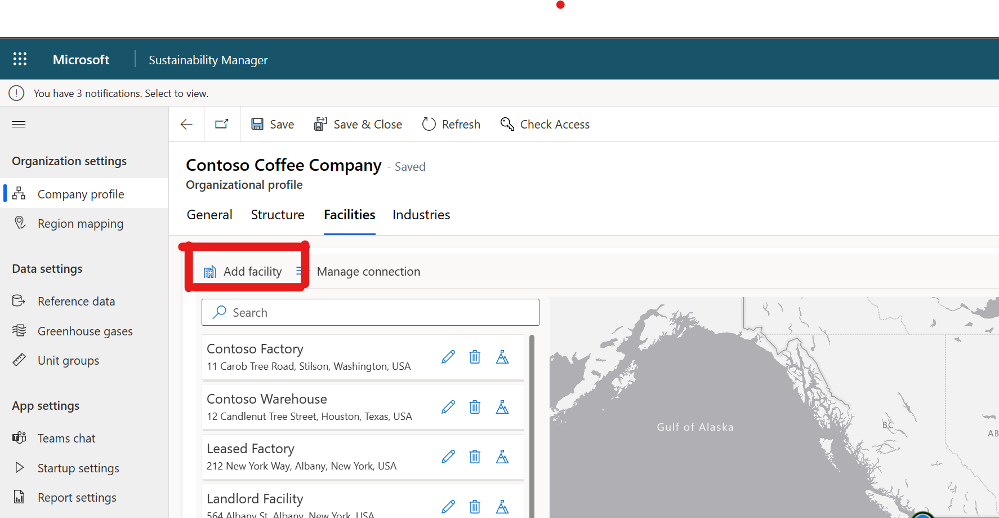

6. Then you have to connect your Facility also to the MSM calculation models. Therefore please navigate to the Data page (menu left bottom). 

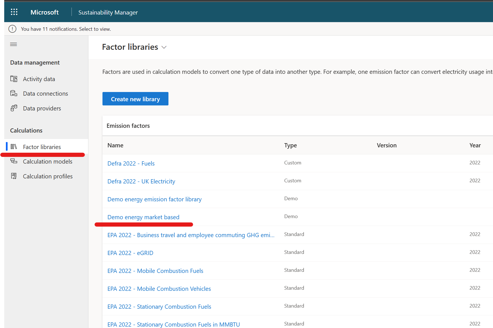

7. Click on 'New factory mapping' where we can connect the Facility to the right library.

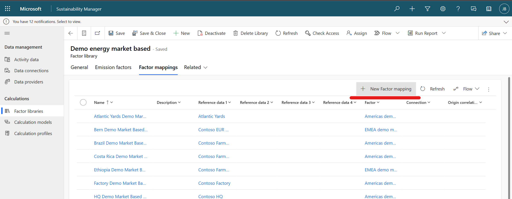

8. Give your factor mapping a name, for example Seattle Facility. Select in the reference data the name of your facility, in our case 'Seattle' and connect the factor to it. Because this factory is based in Seattle, I will connect the America library to it.


## Import data from Azure Data Explorer
Now we can import the energy data (scope 2) from Azure Data Explorer. In the current setup of this solution not all the needed fields for MSM are in the solution.

### Different tenants (Azure and MSM)
9. If you are importing from a different Azure tenant the data from Azure Data Explorer you need to add the full FQDN name. Run the following script on your Azure Data Explorer when needed: 

```
.add database ['ADXDATABASE'] users ('aaduser=YOURFULLFQDN') 'Test MSM (AAD)'
```

For this demo a seperate ADX Function has been created without the location name to make it easier. Add this function to ADX. 

```
.create-or-alter function  GetDigitalTwinIdForUANodeTest(stationName:string,displayName:string) {
let dataHistoryTable = adt_dh_mtcamsafactory_ADT_westeurope; // set to the name of your data history table
let dtId = toscalar(dataHistoryTable
| where Key == 'equipmentID'
| where Value has stationName
| where Value has displayName
| project Id);
print dtId
}
```

10. Navigate to the setting menu and select 'Data'. On the top select the Data Connections and create a new 'Connect to data'. 

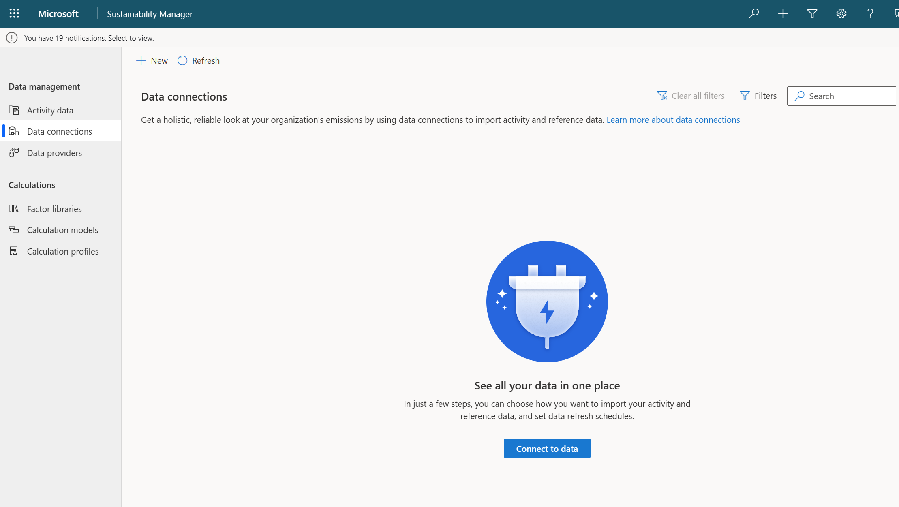


11. Select Activity data and select 'Scope 2 - Purchased Electricity'. We are importing kWh usage, if you have other data please select then the right Activity data.  


12. Select the Azure Data Explorer (KUSTO) connector, if you don't see it in the list, select 'browse all'.

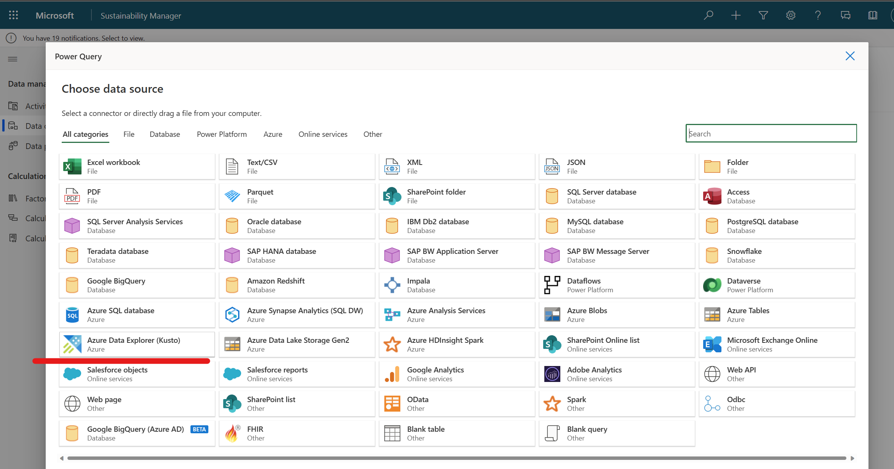

13. Add your URL of your:
- Cluster - full URL name
- Database name
- In the table name the following query

### Query

```
let msmTable = adt_dh_mtcamsafactory_ADT_westeurope
| where Id == toscalar(GetDigitalTwinIdForUANodeTest("assembly", "EnergyConsumption"));
msmTable
| where isnotnull(SourceTimeStamp)
| extend energy = todouble(Value)
| summarize sum(energy) by bin(SourceTimeStamp, 1d)
| project name="EnergyConsumption Factory", OrganizationalUnit="NAME OF YOUR COMPANY", energytype="Electricity", facility="Seattle", energyprovider="YOUR ENERGY PROVIDER", isrenewable="No", dataquality="Metered", consumptionstartdate=SourceTimeStamp, consumptionenddate=SourceTimeStamp, quantity=sum_energy, quantityunit="kWh";
```
Because the solution don't have all the context yet that is needed for MSM in the query certain fields are hard cooked (Capital Letters). Please change them according. 

And clikc on 'Sign in'. You will get a pop-up to login with your account. If that is not working, you need to add your account to the ADX explorer (step 9 in this manual)

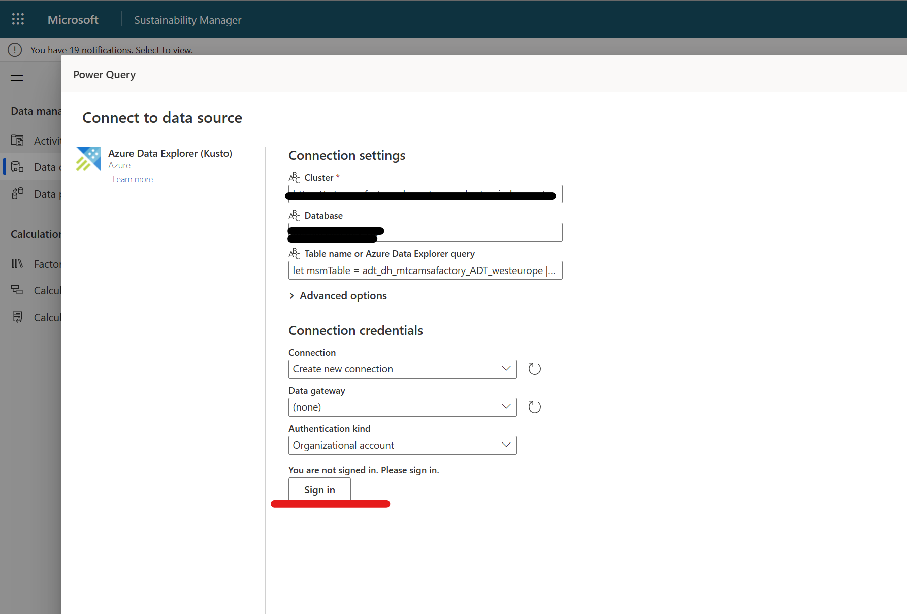

14. Now you should see your data loading in the screen. Select the 'Map to Entity' button. 
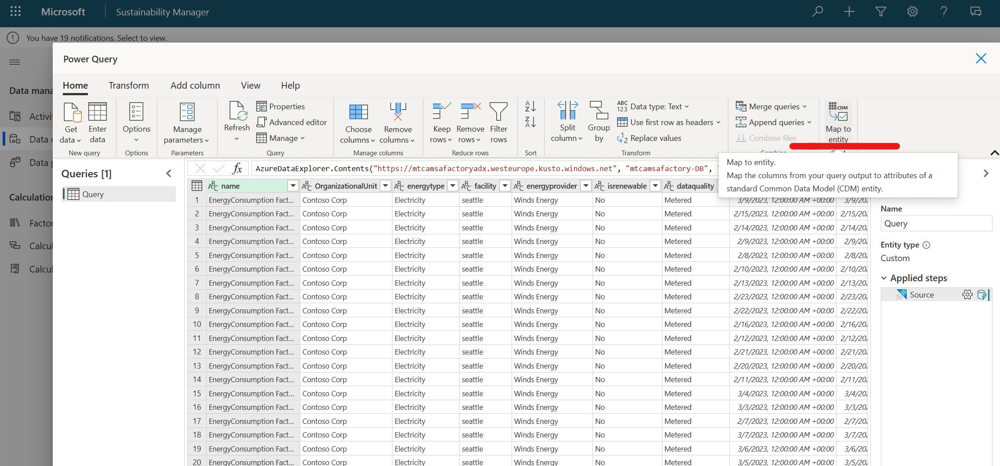

15. Select Energy and click on Auto map. The ones that not be can mapped, just manual map them. Click on 'Ok' when you are finished. Hit then the 'Create' button and your connection has been created.

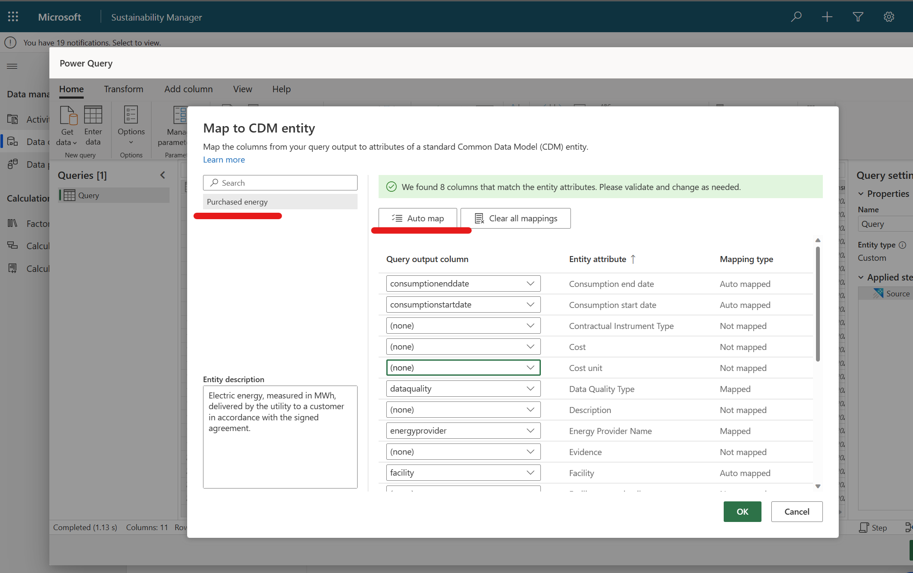

16. If you want to import it automatically you can select that, in this case we just do it onces. When you select daily, ajust your query to only get the day - 1 day. Else you will get double records. 

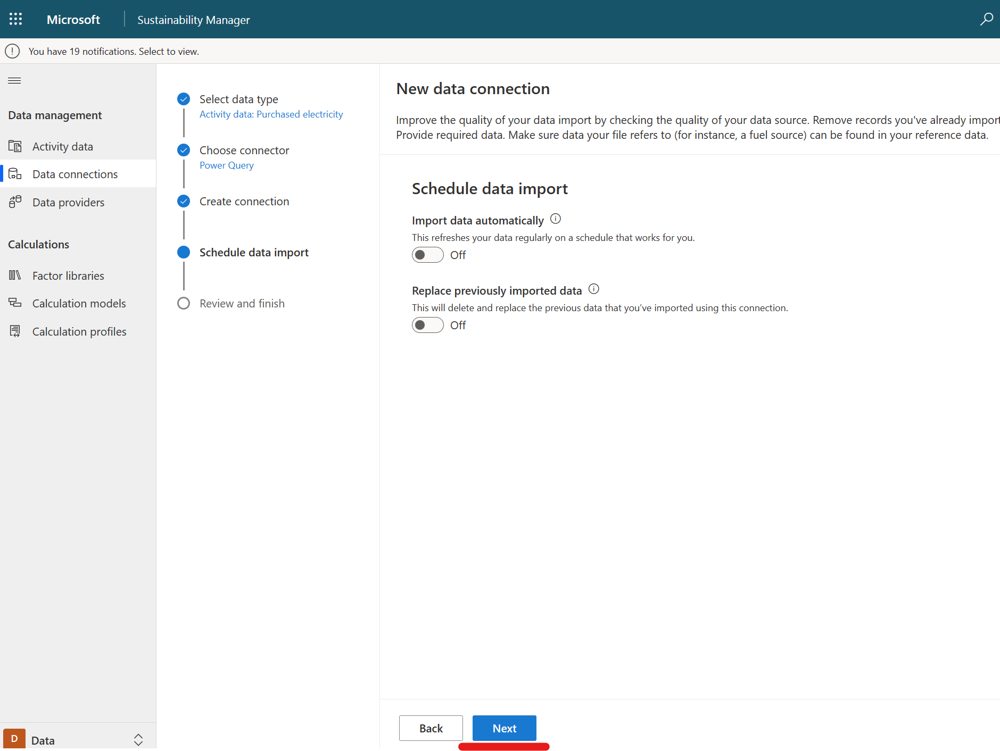

17. Give your connection and name and save. Give it some minutes to import your data into MSM. 

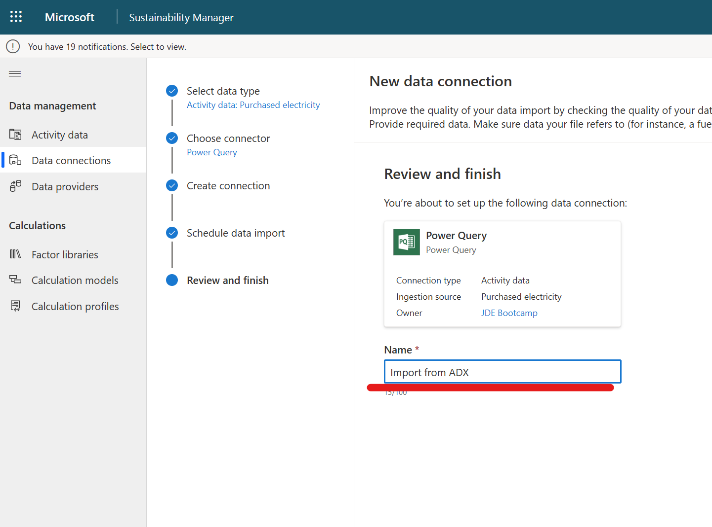

If it is completed you will see this screen. 


18. Now you run the calculation. Depending on your settings in MSM, this is automatically done, but if not, go to the 'Calculation profiles'. Select the Purchased Electricity profile (that is connected to your factory) and Run the calculation.


Within some minutes your dashboard should be updated with the new emissions that are coming from the solution!